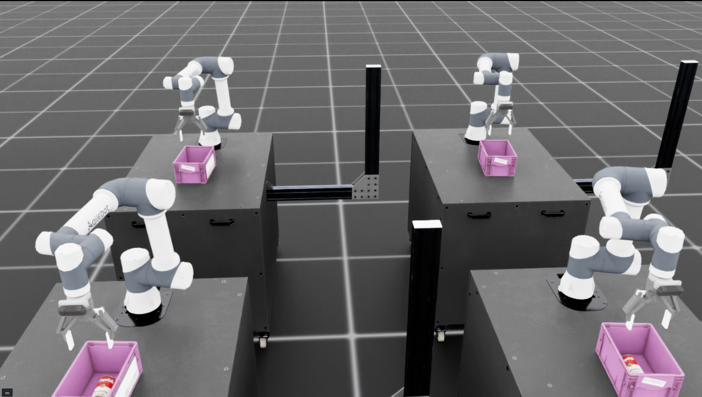

# IsaacLab 抓取与放置 (Pick-and-Place) 演示项目

[English Version](./README.md)

本项目是基于 **IsaacLab** 开发的高性能仿真演示程序，展示了 **Agilebot** 机器人执行自动抓取与放置任务的能力。该项目具有健壮的基于状态机的控制流、多环境同步以及先进的倾斜补偿抓取功能。



## 🚀 功能特性

- **自主抓取与放置**：实现从物体检测（仿真）、抓取、抬升到放置在容器中的完整循环。
- **状态机控制**：模块化控制逻辑，分为清晰的阶段（抵达、抓取、提升、放置等）。
- **多环境支持**：支持同时运行多个并行的仿真环境，提高效率。
- **倾斜补偿**：先进的数学逻辑，用于处理和抓取倾斜或翻转的物体。
- **碰撞检测**：实时监控机器人非夹爪部分的受力情况，确保安全。
- **随机化机制**：支持物体位置和姿态的随机噪声，用于测试算法的鲁棒性。

## 📂 目录结构

- `main.py`：项目入口脚本，用于启动仿真和演示。
- `env/`：包含环境和场景配置 (`pick_place_env.py`)。
- `controller/`：抓取与放置的核心控制逻辑。
    - `phases/`：各个状态机阶段的具体实现。
    - `pick_place_controller.py`：高层控制器调度。
    - `tilt_aware_grasping.py`：针对非垂直姿态抓取的专门逻辑。
- `core/`：仿真工具类和通用辅助函数。
- `assets/`：机器人模型文件（URDF/USD）及其贴图。

## 🛠️ 快速入门

### 前置条件

- 已安装 NVIDIA Isaac Sim 和 IsaacLab。
- Isaac Lab 官方安装参考：`https://isaac-sim.github.io/IsaacLab/main/index.html`
- 已配置好 Conda 环境（例如 `isaaclab`）。

### 运行程序

使用默认设置启动演示：
```bash
python main.py --enable_cameras
```

运行 4 个并行环境并显示可视化标记：
```bash
python main.py --enable_cameras --num_envs 4 --show-markers
```

启用倾斜补偿抓取功能（使用 'aligned' 侧边抓取应对严重翻倒的物体）：
```bash
python main.py --enable_cameras --enable-tilt-compensation --grasp-strategy aligned --show-markers
```

## ⚙️ 常用参数

| 参数 | 默认值 | 说明 |
| :--- | :--- | :--- |
| `--num_envs` | `1` | 并行仿真环境数量。 |
| `--show-markers` | `False` | 显示 TCP / 抓取点 / 放置点可视化标记。 |
| `--enable_cameras` | `False` | 启用相机传感器（本 Demo 必需）。 |
| `--enable-tilt-compensation` | `False` | 启用倾斜/翻倒物体抓取补偿。 |
| `--grasp-strategy` | `vertical` | 倾斜物体抓取策略（`vertical` 垂直对齐或 `aligned` 姿态对齐）。开启 `aligned` 时允许对翻倒物体进行水平侧面抓取。 |
| `--reset-interval-steps` | `900` | 超过该物理仿真步数后，自动重置环境。 |
| `--control-noise` | `0.0` | 机器初始位置的关节噪声，单位弧度。保证机器人初始位姿大致相同但不相等，用于VLA数据采集。 |
| `--disable-non-gripper-collision-check` | `False` | 关闭非夹爪碰撞检测（默认开启检测）。 |
| `--non-gripper-collision-force-threshold` | `20.0` | 非夹爪碰撞判定阈值（N）。 |
| `--device` | IsaacLab 默认 | 仿真设备（由 AppLauncher 提供，如 `cpu` / `cuda:0`）。 |
| `--headless` | `False` | 无 GUI 模式运行（由 AppLauncher 提供）。 |

完整参数列表请运行：
```bash
python main.py --help
```

## 🧩 常见问题（Troubleshooting）

- **启动时报 USD 路径/资产缺失**：确认已获取 Agilebot USD 资产，并在仓库根目录 `assets/agilebot.py` 配置正确路径。
- **相机相关报错 / 无相机数据**：本 Demo 依赖相机传感器，请确保启动时包含 `--enable_cameras`（Isaac Lab AppLauncher 参数）。
- **无 GUI 运行**：可尝试 `python main.py --headless`（透传给 Isaac Lab AppLauncher）。
- **性能/显存不足**：逐步增大 `--num_envs`，并观察 GPU/显存占用。


---
Copyright (c) 2026, Agilebot Robotics Co., Ltd.
